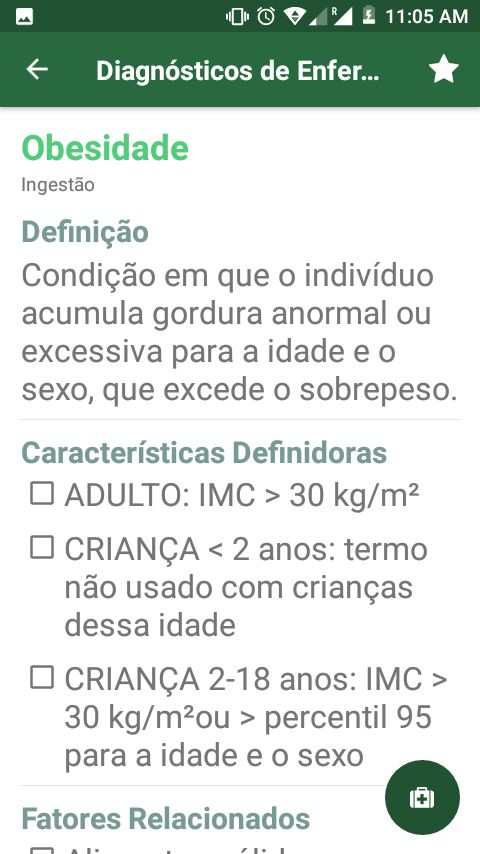
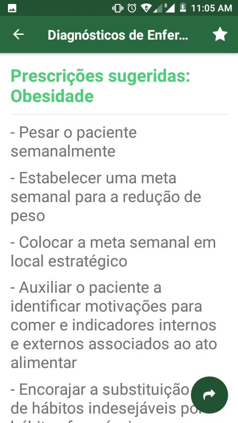
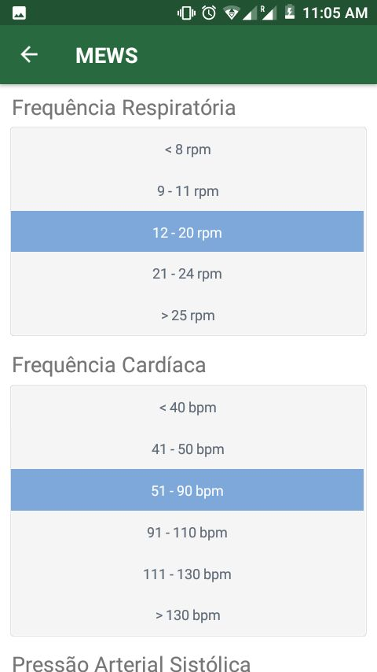
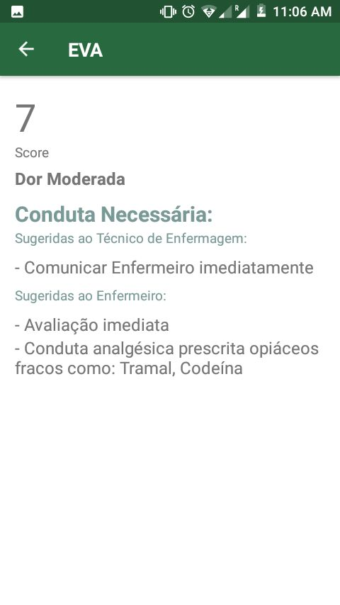

# Diane

Diane a app that help nurses, providing Diagnosis for different domains and issue, and some cases there is prescription for that problem.

  
  
  

  
  
  

  
  
  

More details at Google Play
